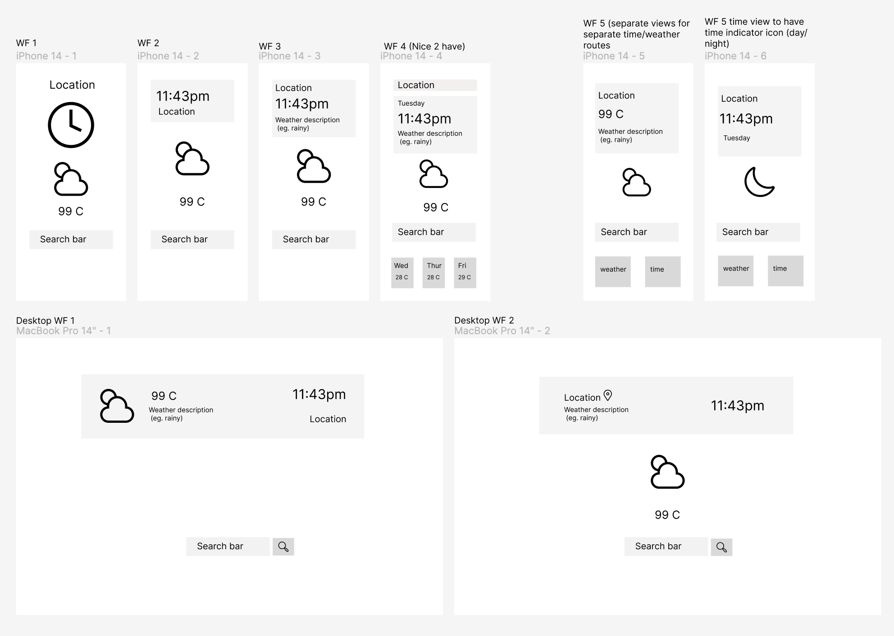

# Hackathon_22_05_23
## Purpose, Goals:   

## [See the live deployed version here](https://gpweatherclock.netlify.app/)

Clock and Weather application. 

Has been made with the intention of becoming more familiar with:
- Git Collaboration
- Collaborative development
- Deployment
- Build presentation

API's used:

Time: https://www.abstractapi.com/
Weather: https://openweathermap.org/
 
## Features: 

Search bar to capture user input.
Displays weather information of location captured by input.
Displays timezone of location captured by input.
Different backgrounds and weather icons dependent upon the time and weather values.
Responsive design.

## Wireframe:

Throughout the build of this project our group communicated through discord text and call, and had daily standup meetings to discuss features and progress. 

