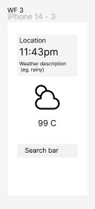

## Purpose, Goals:   
Create a  Clock and Weather app. Nothing super new, but I just want to go through all process steps:
 - development
 - deployment, Git Colaboration
 - presentation                                     
 
 
 
 
 This example is drawn from  in T3/WK6 class /state model. It is a bit old, so we converted  it to functional elements,  more modern react. We still need to decdide on an API to fetch the weather information.
 
 ## Todo: 
 
 Integrate Weather function.
 Fix season dependant Display
 Create Build and first Deploy

 ## Repo: https://github.com/stuWolf/Hackathon_22_05_23

 ## Journal:
22/05/23 Monday
Kickoff meeting, get to know
 
 23/05/ Tuesday
2 meetings, decided on A wireframe layout

Features:
Must have: 
- Digital clock local time H:Min:Sec:AM/PM
- Display location
- Weather description
- Weather Symbol and temperature
- Search bar for location

Nice to have:
3 day weather forecast
Display day
Display time at selected location( would require world clock API, currently we use Date. of system time)

To Do list: 

1. Search bar - James
2. API fetching based on user input from the search bar - Kriszta
3. Displaying API data - Kriszta
4. Clock transform from analog display to digital and add to other data display - Wolf
5. Styling - James
6. Presentation - James

## Wireframe:

 
 
 ## 24/05/ Wednesday

Still to do: 
- Integration
- Styling, CSS, Sass maybe use tailwind
- figure out GIT colaboration
- Deployment
